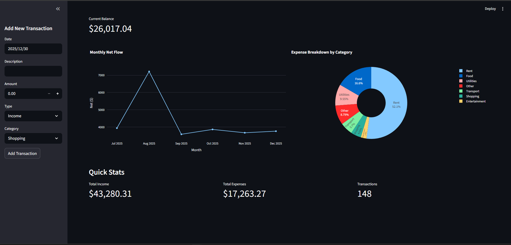

# Personal Finance Dashboard

Interactive web app to track income, expenses, budgets, and financial trends — built with Python, Streamlit, Pandas & Plotly.

## Demo (Live)
[](https://your-app-name.streamlit.app)  <!-- Deploy to Streamlit Cloud first! -->

## Screenshots

**Overview Dashboard**  



## Features
- Manual & CSV import of transactions  
- Real-time balance & monthly net flow  
- Category-based expense breakdown (interactive pie chart)  
- Persistent data (CSV storage)  
- Clean dark theme UI  

## Tech Stack
- Python 3.12+  
- Streamlit (frontend & interactivity)  
- Pandas (data processing)  
- Plotly (beautiful charts)  

## Installation
```bash
git clone https://github.com/yourusername/personal-finance-dashboard.git
cd personal-finance-dashboard
python -m venv venv
source venv/bin/activate  # Windows: venv\Scripts\activate
pip install -r requirements.txt
streamlit run app.py
